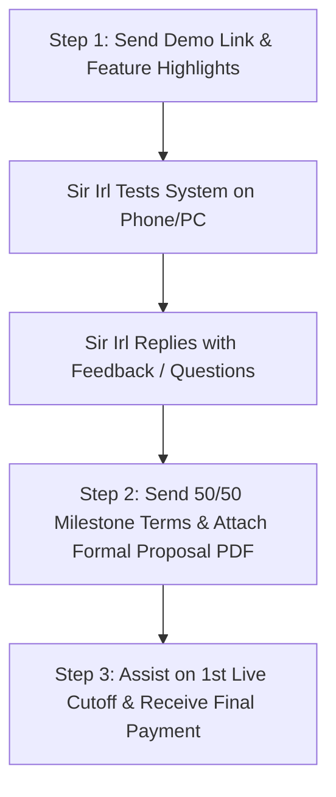

# Ron's Chicken Custom Payroll & Biometric Attendance System

**Business Name:** Ron's Chicken (Lechon Manok & Liempo)  
**Branch:** Cugman Branch (Cagayan de Oro City, Misamis Oriental, Philippines)  
**Client / Owner Contact:** Sir Irl & Management • 0928 775 6605 • [Facebook Page](https://www.facebook.com/pages/Rons-Chicken/1808066046182615)  
**Developer:** Jason Jeff D. Velasquez  
**Live Deployment (Vercel):** [https://rons-chicken-payroll.vercel.app](https://rons-chicken-payroll.vercel.app)  
**GitHub Repository:** [https://github.com/jasonvelasquez1410/rons-chicken-payroll](https://github.com/jasonvelasquez1410/rons-chicken-payroll)  

---

## 1. Project Background & Objective

- **Current Biometric Hardware:** **Deli e3960** (Standalone fingerprint biometric attendance clock, non-WiFi).
- **Core Workflow:** Staff punch on the Deli e3960 at Cugman branch. The supervisor downloads the attendance record to a USB flash drive as an Excel spreadsheet (`cugman_(August)Employee Attendance Record.xls`).
- **Goal Achieved:** A Progressive Web Application (PWA) tailored for Ron's Chicken to ingest Deli e3960 USB attendance exports in under 1 second, automate DOLE/BIR compliant payroll calculations, manage cash advance (*vale*) ledgers, generate single-line print-ready batch payslips, and protect data via continuous local auto-backups with **$0 monthly server/database fees**.

---

## 2. Core Modules & Implemented Features

### A. Deli e3960 Biometric Ingestion (`js/biometric-parser.js`)
- Parses multi-punch timestamp matrices exported by the Deli e3960.
- Handles overnight roasting shifts, calculates late/undertime, deducts mandatory 1-hour lunch breaks for shifts > 5 hours, and generates comprehensive timecards for all 31 Cugman staff.

### B. Philippine DOLE & BIR Payroll Engine (`js/payroll-engine.js`)
- **Wages & Premiums:** Daily rate (₱438.00–₱480.00), Regular Overtime (125%), Night Shift Differential (10% from 10 PM–6 AM), and Daily Food Allowance (₱50/day).
- **Statutory Deductions:** SSS (official contribution brackets), PhilHealth (5% total, 2.5% EE share), Pag-IBIG (₱100/cutoff), and BIR TRAIN Law withholding tax exemptions (minimum wage earners are 100% tax exempt).
- **13th Month Pay Accrual:** Real-time continuous accrual (`Basic Pay / 12`).

### C. Interactive Cutoff Date Controller Bar (`js/app.js`)
- Positioned across Overview, Attendance, and Payroll views.
- **Preset Dropdowns:** Instant switching between `Aug 16 - Sep 05`, `Sep 01 - Sep 15`, `Sep 16 - Sep 30`, `Oct 01 - Oct 15`, `Oct 16 - Oct 31`.
- **Custom Date Pickers:** `From:` and `To:` date pickers with `⚡ Apply & Recalculate`.
- **`+ New Cutoff` Modal:** Enables adding and naming future cutoff periods.

### D. Single-Line Print-Ready Batch Payslips (`js/app.js`, `css/style.css`)
- 1-Click batch payslip generator for all 31 staff.
- Header date formatting locked to a single line (`white-space: nowrap; flex-shrink: 0; Period: 2026-08-16 to 2026-08-31`) preventing awkward wrapping on printouts.

### E. Data Safety & Continuous Auto-Backup Center (`js/db.js`, `js/app.js`)
- **Client-Side Persistent Storage:** IndexedDB & LocalStorage with `navigator.storage.persist()` (immune to browser eviction during cache cleanups).
- **Continuous Auto-Snapshots:** Rolling snapshots captured on every attendance upload, staff rate edit, or vale entry.
- **1-Click Export / Import:** Instant `.json` database download/restore for easy computer transfers and Google Drive backup.

### F. Formal Proposal & Quotation Document (`Rons_Chicken_Custom_Payroll_Proposal_Quotation.html` / `.pdf`)
- Single-page executive proposal with project scope, ₱30,000 quotation breakdown, 2-part milestone payment terms (50% / 50%), and Conforme signature block.

---

## 3. Commercial Terms & Pricing Structure

- **Total One-Time Project Investment:** **₱30,000.00**
  - Custom Payroll & Biometric Engine (Lifetime Ownership, $0 monthly fees): **₱25,000.00**
  - Deployment, Onboarding, 1st Cutoff Assistance & 30-Day Warranty: **₱5,000.00**
- **Milestone Payment Terms (50% / 50%):**
  - **Milestone 1 (50% - ₱15,000.00):** System Delivery, UAT Access & Demo Acceptance
  - **Milestone 2 (50% - ₱15,000.00):** Completion of 1st Live Cutoff Payroll Run & Final Turnover

---

## 4. Sales & Client Handover Playbook (Sir Irl)



1. **Step 1 Message:** Send the friendly demo link message with remote payroll instructions.
2. **Step 2 Message:** Upon his reply, send the pricing summary and attach `Rons_Chicken_Custom_Payroll_Proposal_Quotation_v2.pdf`.
3. **Step 3 Live Run:** Assist management in running their first actual cutoff with live USB attendance.

---

## 5. File & Directory Structure

```
📁 Ron's Chicken Custom Payroll System/
├── 📄 project.md                                       # Master project documentation (this file)
├── 📄 README.md                                        # Git & setup guide
├── 📄 Rons_Chicken_Custom_Payroll_Proposal_Quotation.html # Single-page formal proposal source
├── 📄 Rons_Chicken_Custom_Payroll_Proposal_Quotation_v2.pdf # Print-ready single-page proposal PDF
├── 📄 index.html                                       # Application shell (PWA)
├── 📄 manifest.json                                    # PWA manifest
├── 📄 sw.js                                            # Service Worker (Network-First caching)
├── 📄 vercel.json                                      # Vercel deployment config
├── 📄 cugman_(August)Employee Attendance Record.xls    # Real Deli e3960 attendance sample
├── 📁 assets/
│   └── 🖼️ logo.jpg                                     # Ron's Chicken official logo
├── 📁 css/
│   └── 🎨 style.css                                    # Bento Grid, Theme Dimmer & Print CSS
└── 📁 js/
    ├── ⚙️ db.js                                        # Persistent DB, Auto-Backups & 31 staff
    ├── ⏱️ biometric-parser.js                          # Deli e3960 Excel parser & timecard engine
    ├── 💰 payroll-engine.js                            # DOLE/BIR statutory calculation engine
    ├── 📡 device-sync.js                               # Hardware USB config & Cloud push API
    └── 🚀 app.js                                       # Cutoff controller, views, payslips & UI
```

---

## 6. Incident Log & Technical Resolution (Desktop Cache & Blank Screen)

### Issue Summary:
- **Reported By:** Sir Irl (Client Management)
- **Symptom:** Desktop Google Chrome loading a solid white screen (`rons-chicken-payroll.vercel.app`) with no theme background or spinner.
- **Root Cause:** Sir Irl's desktop Chrome held onto an older Service Worker / HTTP cache from a previous build. Because PWAs prioritize cached assets, standard refreshes (`F5`) loaded the stale cached build instead of pulling new files from Vercel.

### Technical Fixes Implemented & Deployed:
1. **Strict Cache-Control Headers (`vercel.json`):**
   - Configured global `no-cache, no-store, must-revalidate, max-age=0` with `Pragma` and `Expires` headers on all responses so browsers always fetch live files.
2. **Eliminate SW Re-Registration & ControllerChange Reload Loop (`js/app.js` & `sw.js`):**
   - Removed SW registration from `app.js` which previously fought with `index.html` unregistration logic.
   - Configured `sw.js` as an auto self-destruct script that automatically purges all Cache Storage and unregisters itself whenever legacy browsers check it.
3. **Asset Cache Busting Query Parameters (`index.html`):**
   - Appended `?v=2.1.0` to `style.css`, `db.js`, `biometric-parser.js`, `payroll-engine.js`, `device-sync.js`, and `app.js` to ensure browsers bypass cached scripts.
4. **Resolved Quirks Mode & Currency Symbol Encoding:**
   - Ensured strict standard mode `<!DOCTYPE html>` at byte 0.
   - Fixed Philippine Peso symbol encoding (`₱`) in `js/db.js`.

### Key Commits Pushed to `main`:
- `92b1867`: Anti-white-screen inline styling, safe storage fallback, deferred SheetJS.
- `0ece806`: Strict no-cache headers in `vercel.json`, SW auto-update controller listener.
- `6ac5abf`: Non-blocking Google Fonts head links, auto-purge stale SW registrations, direct network fetch in `sw.js`.
- Latest: Self-destructing SW, asset cache-busting `?v=2.1.0`, fix SW reload loop, and clean Vercel headers.

---

## 7. Client Communication & Reply to Sir Irl

**Suggested Tagalog Reply to Sir Irl:**
> "Hi Sir Irl, naayos na po! Na-clear na po natin yung legacy service worker cache conflict na nagko-cause ng blank white page sa desktop Chrome/Edge. Paki-refresh po ulit yung link sa Chrome/Edge (or press `Ctrl + F5` minsan lang para ma-load yung updated version):
> 👉 **https://rons-chicken-payroll.vercel.app**
> 
> Makikita niyo na po yung buong Ron's Chicken Cugman Manager Portal at Biometric Attendance Records!"

