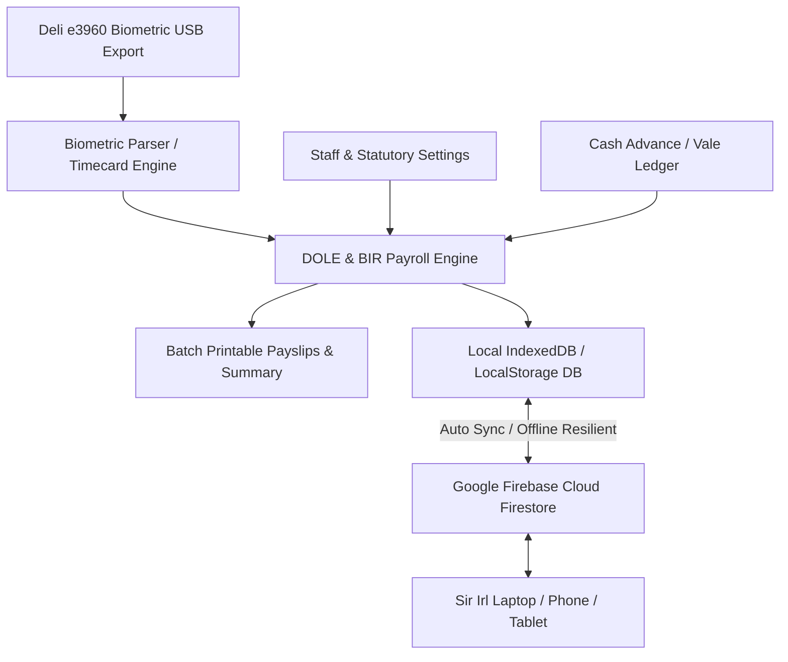
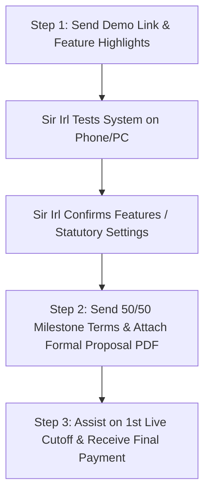

# Ron's Chicken Custom Payroll & Biometric Attendance System

**Business Name:** Ron's Chicken (Lechon Manok & Liempo)  
**Branch:** Cugman Branch (Cagayan de Oro City, Misamis Oriental, Philippines)  
**Client / Owner Contact:** Sir Irl & Management • 0928 775 6605 • [Facebook Page](https://www.facebook.com/pages/Rons-Chicken/1808066046182615)  
**Developer:** Jason Jeff D. Velasquez  
**Live Deployment (Vercel):** [https://rons-chicken-payroll.vercel.app](https://rons-chicken-payroll.vercel.app)  
**GitHub Repository:** [https://github.com/jasonvelasquez1410/rons-chicken-payroll](https://github.com/jasonvelasquez1410/rons-chicken-payroll)  

---

## 1. Project Background & Objective

- **Hardware Environment:** **Deli e3960** (Standalone fingerprint biometric attendance clock, non-WiFi).
- **Core Workflow:** Staff punch on the Deli e3960 at Cugman branch. The supervisor exports the attendance record to a USB flash drive as an Excel spreadsheet (`cugman_(August)Employee Attendance Record.xls`).
- **Goal Achieved:** A Progressive Web Application (PWA) tailored for Ron's Chicken to ingest Deli e3960 USB attendance exports in under 1 second, automate DOLE/BIR compliant payroll calculations, manage cash advance (*vale*) ledgers, generate single-line print-ready batch payslips, and synchronize data across all devices in real time with **$0 monthly server/database fees** (Google Firebase Spark Free Tier).

---

## 2. System Architecture & Implemented Modules


```mermaid
graph TD
    A[Deli e3960 Biometric USB Export] --> B[Biometric Parser / Timecard Engine]
    B --> C[DOLE & BIR Payroll Engine]
    D[Staff & Statutory Settings] --> C
    E[Cash Advance / Vale Ledger] --> C
    C --> F[Batch Printable Payslips & Summary]
    C --> G[Local IndexedDB / LocalStorage DB]
    G <-->|Auto Sync / Offline Resilient| H[Google Firebase Cloud Firestore]
    H <--> I[Sir Irl Laptop / Phone / Tablet]
```

### A. Deli e3960 Biometric Ingestion (`js/biometric-parser.js`)
- Ingests raw timestamp matrices exported by the Deli e3960.
- Handles overnight roasting shifts, calculates late/undertime, deducts mandatory 1-hour lunch breaks for shifts > 5 hours, and generates comprehensive timecards for all 31 Cugman staff.

### B. Philippine DOLE & BIR Payroll Engine (`js/payroll-engine.js`)
- **Wages & Premiums:** Daily rate (₱438.00–₱480.00), Regular Overtime (125%), Night Shift Differential (10% from 10 PM–6 AM), and Daily Food Allowance (₱50/day).
- **Statutory Deductions (SSS, PhilHealth, Pag-IBIG):**
  - **Semi-Monthly Split (Default):** The system automatically divides monthly statutory contributions in half (50% on the 15th cutoff, 50% on the 30th/31st cutoff) to prevent heavy one-time deductions:
    - SSS: Split in half (~₱258.75 on the 15th, ~₱258.75 on the 31st for ₱438/day rate).
    - PhilHealth (PHIC): Split in half (~₱143.00 per cutoff based on 5% premium).
    - Pag-IBIG (HDMF): Standard ₱100.00 per cutoff (totaling ₱200/month).
  - **Manual Overrides:** Management can type any custom fixed peso deduction per cutoff in **Staff & Statutory** (`customSssAmount`, `customPhilHealthAmount`, `customPagIbigAmount`).
  - **1-Click Exemptions:** Checkboxes for **Exempt SSS**, **Exempt PHIC**, **Exempt HDMF** for probationary or voluntary staff.
  - **Tax Exemption:** Minimum wage earners earning ≤ ₱10,417 per cutoff are 100% Tax Exempt under TRAIN Law (₱0.00 tax).
- **13th Month Pay Accrual:** Real-time continuous accrual (`Basic Pay / 12`).

### C. Real-Time Multi-Device Cloud Sync (`js/firebase-sync.js`)
- **Zero-Setup Sync Engine:** Integrated directly with Google Firebase Firestore (Project: `rons-chicken-payroll`).
- **Cross-Device Continuity:** Changes made on Sir Irl's laptop (attendance uploads, rate changes, vale deductions) automatically appear on his smartphone or manager tablet in real time via `onSnapshot` listeners.
- **Offline-First Resilience:** If branch WiFi or mobile data drops, the app works 100% locally in IndexedDB/LocalStorage (badge displays `🟡 Offline (Queued)`). Once reconnected, all queued updates automatically push to the cloud (badge updates to `🟢 Cloud Synced`).
- **Cost:** 100% free ($0 monthly cost) utilizing <0.05% of Google Firebase Spark Free Tier quotas.

### D. Interactive Cutoff Date Controller Bar (`js/app.js`)
- Positioned across Overview, Attendance, and Payroll views.
- **Preset Dropdowns:** Instant switching between semi-monthly periods (`Aug 16 - Aug 31`, `Sep 01 - Sep 15`, `Sep 16 - Sep 30`, `Oct 01 - Oct 15`, `Oct 16 - Oct 31`).
- **Custom Date Pickers:** `From:` and `To:` date pickers with `⚡ Apply & Recalculate`.
- **`+ New Cutoff` Modal:** Enables adding and naming future cutoff periods.

### E. Single-Line Print-Ready Batch Payslips (`js/app.js`, `css/style.css`)
- 1-Click batch payslip generator for all 31 staff.
- Clean thermal / standard print format with locked single-line date headers preventing awkward wrapping.

### F. Formal Proposal & Quotation Document (`Rons_Chicken_Custom_Payroll_Proposal_Quotation.html` / `.pdf`)
- Single-page executive proposal with project scope, ₱30,000 quotation breakdown, 2-part milestone payment terms (50% / 50%), and Conforme signature block.

---

## 3. Commercial Terms & Pricing Structure

- **Total One-Time Project Investment:** **₱30,000.00**
  - Custom Payroll & Biometric Engine (Lifetime Ownership, $0 monthly fees): **₱25,000.00**
  - Deployment, Onboarding, 1st Cutoff Assistance & 30-Day Warranty: **₱5,000.00**
- **Milestone Payment Terms (50% / 50%):**
  - **Milestone 1 (50% - ₱15,000.00):** System Delivery, UAT Access & Demo Acceptance
  - **Milestone 2 (50% - ₱15,000.00):** Completion of 1st Live Cutoff Payroll Run & Final Turnover

---

## 4. Sales & Client Handover Playbook (Sir Irl)


```mermaid
graph TD
    A[Step 1: Send Demo Link & Feature Highlights] --> B[Sir Irl Tests System on Phone/PC]
    B --> C[Sir Irl Confirms Features / Statutory Settings]
    C --> D[Step 2: Send 50/50 Milestone Terms & Attach Formal Proposal PDF]
    D --> E[Step 3: Assist on 1st Live Cutoff & Receive Final Payment]
```

1. **Step 1 Message:** Send the live Vercel link (`https://rons-chicken-payroll.vercel.app`) with remote payroll instructions.
2. **Step 2 Message:** Upon his confirmation, send the pricing summary and attach `Rons_Chicken_Custom_Payroll_Proposal_Quotation_v2.pdf`.
3. **Step 3 Live Run:** Assist management in running their first actual cutoff with live USB attendance.

---

## 5. File & Directory Structure

```
📁 Ron's Chicken Custom Payroll System/
├── 📄 project.md                                       # Master project documentation & resume notes
├── 📄 README.md                                        # Git & setup guide
├── 📄 Rons_Chicken_Custom_Payroll_Proposal_Quotation.html # Single-page formal proposal source
├── 📄 Rons_Chicken_Custom_Payroll_Proposal_Quotation_v2.pdf # Print-ready single-page proposal PDF
├── 📄 index.html                                       # Application shell (PWA)
├── 📄 manifest.json                                    # PWA manifest
├── 📄 sw.js                                            # Service Worker (Auto-cache purge & network-first)
├── 📄 vercel.json                                      # Vercel deployment & strict cache headers
├── 📄 cugman_(August)Employee Attendance Record.xls    # Real Deli e3960 attendance sample
├── 📁 assets/
│   └── 🖼️ logo.jpg                                     # Ron's Chicken official logo
├── 📁 css/
│   └── 🎨 style.css                                    # Bento Grid, Theme Dimmer & Print CSS
└── 📁 js/
    ├── ⚙️ db.js                                        # Persistent DB, Auto-Backups, 31 Staff Profiles
    ├── ⏱️ biometric-parser.js                          # Deli e3960 Excel parser & timecard engine
    ├── 💰 payroll-engine.js                            # DOLE/BIR statutory calculation engine & semi-monthly split
    ├── ☁️ firebase-sync.js                             # Real-time multi-device cloud synchronization
    ├── 📡 device-sync.js                               # Hardware USB config & Cloud push API
    └── 🚀 app.js                                       # Cutoff controller, views, payslips & UI
```

---

## 6. Incident Log & Technical Resolutions

1. **Desktop Chrome/Edge Loading Issue:**
   - **Root Cause:** Legacy Service Worker held stale cached scripts; false-alarm 4.5s timeout trap triggered warning modals on slow network queries.
   - **Resolution:** Removed aggressive timeout alert, made SheetJS load on-demand, added defensive database getters, configured `sw.js` self-destruct/cache purge, and added strict cache headers in `vercel.json`.
2. **Cross-Device Data Consistency:**
   - **Root Cause:** Standalone IndexedDB kept records isolated to the specific browser/device.
   - **Resolution:** Integrated Firebase Firestore Cloud Sync (`js/firebase-sync.js`) with automatic push on every database save and real-time `onSnapshot` listener.

---

## 7. 🚀 WHAT TO DO NEXT AFTER LAPTOP RESTART (Quick Resume Checklist)

When you turn on your laptop and resume work:

1. **Open the Project Folder:**
   - Open VS Code / IDE in `c:\Users\USER\Documents\Programming Folder Rep\Ron's Chickent Custom Payroll System`.
2. **Verify Live App Status:**
   - Open [https://rons-chicken-payroll.vercel.app](https://rons-chicken-payroll.vercel.app) in your browser.
   - Check the top navbar: it should display `🟢 Cloud Synced`.
3. **Sir Irl Client Follow-up:**
   - Ask Sir Irl if he has tested the live link on his laptop or phone.
   - If Sir Irl is ready to test a live cutoff:
     - Remind him he can drag-and-drop or upload their latest USB attendance file from the Deli e3960.
     - Remind him that SSS / PhilHealth deductions are already automatically cut in half per cutoff (15th and 30th/31st), and he can customize or override any amount in **Staff & Statutory** anytime.
4. **Milestone 1 Payment & Proposal Signing:**
   - Send the formal single-page quotation PDF (`Rons_Chicken_Custom_Payroll_Proposal_Quotation_v2.pdf`) for Conforme signing and Milestone 1 downpayment (₱15,000).
